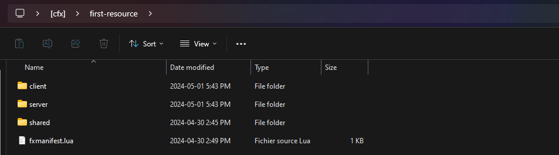
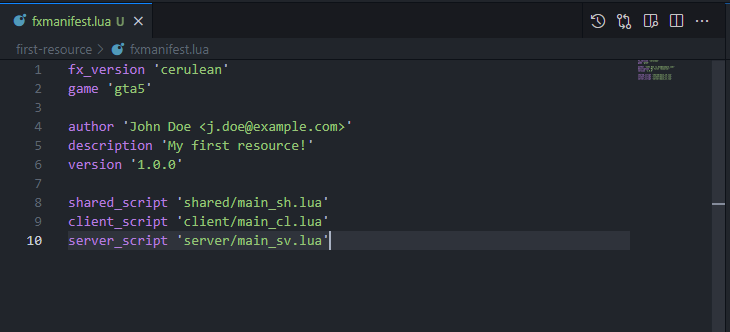
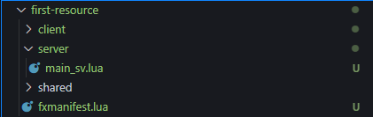
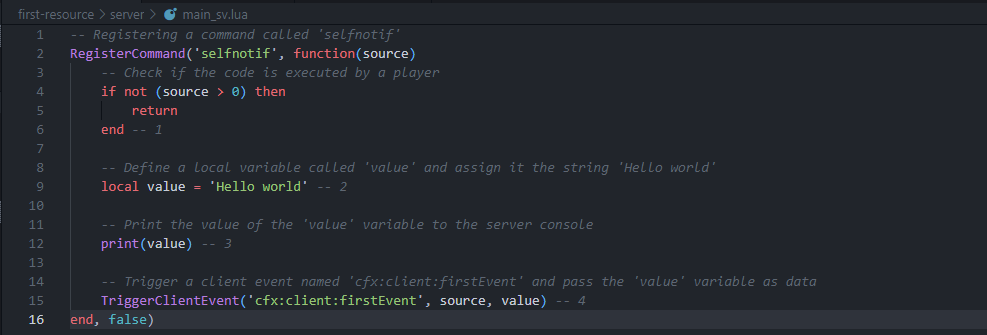
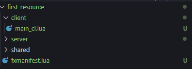
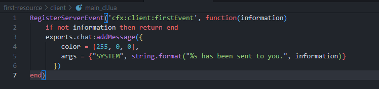
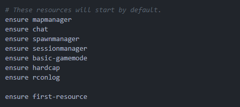
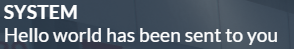
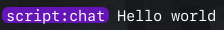

Getting started with scripting for FiveM might be a tad overwhelming, in this simple guide, we'll try to show you how to get started with a quick resource in Lua. 

This simple guide will show you the basics to creating your first resource. This example will teach you how to send a notification to a player.

Prerequisites
-------

To complete this guide, you will need to have all the prerequisites. You can skip ahead to [create the folder](#create-the-folder) section if you have everything.

- [FiveM client](https://docs.fivem.net/docs/client-manual/installing-fivem/)
- [FiveM server](https://docs.fivem.net/docs/server-manual/setting-up-a-server/)
- [Visual Studio Code](https://code.visualstudio.com/download)

Create the folder
--------

Let's establish our first resource within the `resources` folder of your FiveM server. We'll create a folder named `first-resource` to serve as the resource's container. Feel free to choose any name you prefer, but we'll stick with this for the sake of example.



So we should have a folder called `first-resource` in `resources` folder of you FiveM server.

Structure
-------------------------

To enhance the organization of our codebase, we're going to create distinct sections, each serving a specific purpose. We'll create three folders and one file to achieve this:
- `client`: This folder will contain all client-side code, responsible for handling interactions and rendering elements visible to the player.
- `server`: Here, we'll store all server-side logic, including data management, player authentication, and game mechanics that should be processed on the server.
- `shared`: The shared folder will house code that needs to be accessed by both the client and server sides. This could include common functions, constants, or data structures.
- `fxmanifest.lua`: This file is crucial for FiveM resource management. It defines metadata about the resource, such as its name, description, and dependencies.

This should look like this:
```
resources/
└── first-resource/
    ├── client/
    ├── server/
    ├── shared/
    └── fxmanifest.lua
```
## Resource manifest

The resource manifest, often referred to as `fxmanifest.lua`, serves as the structure of your resource. It provides essential instructions to the server regarding what components to initiate and how they are organized. This crucial file defines the structure and composition of your resource, ensuring that the server can interpret and execute it correctly. It defines fundamental metadata about the resource, such as its name, description, version, and dependencies. You can learn more [here](/docs/scripting-reference/resource-manifest/resource-manifest).

```lua
fx_version 'cerulean'
game 'gta5'

author 'John Doe <j.doe@example.com>'
description 'My first resource!'
version '1.0.0'

shared_script 'shared/main_sh.lua'
client_script 'client/main_cl.lua'
server_script 'server/main_sv.lua'
```

Copy this code and past it in the `fxmanifest.lua` file. It should look like this after:



The manifest will read the following:
- Shared script in the `shared` folder
- Client script in the `client` folder
- Server script in the `server` folder

**Note:** You're free to name the folders/files whatever you wish. The names provided here are just common conventions.

## Server side

In order to make our first resource, we will create the file `main_sv.lua` inside `server` folder. This should look like this:



The server-side files, stored in the `server` folder, manage critical operations and data storage inaccessible to players.

In this file, we will start by using [RegisterCommand](https://docs.fivem.net/natives/?_0x5FA79B0F) native. You can learn more about natives [here](/#natives). You can copy the following:
```lua
-- Registering a command called 'selfnotif'
RegisterCommand('selfnotif', function(source)
    -- Ensure the command is executed by a player
    if source == 0 then return end
    
    -- Define and print a local variable
    local value = 'Hello world'
    print(value)
    
    -- Trigger a client event with the value
    TriggerClientEvent('cfx:client:firstEvent', source, value)
end, false)
```

Let's break this into parts:
#### 1. Checking if Code is Executed by a Player:
```lua
if source == 0 then return end
```
This line ensures that the code is executed by a player rather than the server console. If the `source` is not greater than 0 (indicating it's not a player), the function returns early.

#### 2. Defining a Local Variable:
```lua
local value = 'Hello world'
```
This line defines a local variable named `value` and assigns it the string 'Hello world'. In Lua, variables can be localized using the `local` keyword. It's a best practice that helps in managing the scope, efficiency and prevention of name clashes within the codebase. By defining a variable as `local`, it ensures that the variable's value is contained within a specific context and cannot be inadvertently modified from outside that context.

In this example, the `local value` will be only available in the `selfnotif` register command.

#### 3. Printing to the Server Console:
```lua
print(value)
```
This line prints the `value` of the value variable to the server console using the `print()` function. The string 'Hello world' will be displayed in the server console when this command is executed by a player.

#### 4. Triggering a Client Event:
```lua
TriggerClientEvent('cfx:client:firstEvent', source, value)
```
This line triggers a client event named 'cfx:client:firstEvent' and passes the `value` variable as data to clients. Client events are used to send information between the server and clients. In this case, the 'firstEvent' event is triggered for the client associated with the `source` (player) and sends the `value` variable as data.

For further details on the usage of events in FiveM, you can refer to [here](https://docs.fivem.net/docs/scripting-reference/events/).

#### Preview
After following every steps of the server section. The code inside `main_sv` should look like this.



## Client side

To continue the guide, we will create another file `main_cl.lua` inside `client` folder. This should look like this:



The client-side files, located in the `client` folder, control interactions visible to players. Please be careful to never use any sensible information since they can be view by any user.

In this file, we will use an [event](https://docs.fivem.net/docs/scripting-reference/events/). You can copy the following:
```lua
RegisterServerEvent('cfx:client:firstEvent', function(information)
	if not information then return end
  TriggerEvent('chat:addMessage', {
    template = '<div class="chat-message"><b>SYSTEM</b><br>{0} has been sent to you</div>',
    args = {information}
  })
end)
```

Let's break this in part:
#### 1. Checking if param is valid
```lua
if not information then return end
```
This will check if `information` is not `nil` wich could lead to create a issue.

#### 2. Trigger the chat event
```lua
TriggerEvent('chat:addMessage', {
  template = '<div class="chat-message"><b>SYSTEM</b><br>{0} has been sent to you</div>',
  args = {information}
})
```
This event triggers the 'chat:addMessage' event on the client script of the `chat` resource. The message sent includes the value of the `information` parameter returned by the event, along with the string 'has been sent to you.'.

#### Preview
After following every step in the server section. The code inside `main_cl` should look like this.



## Start the resource

Now that we've completed all the necessary steps in this guide, it's time to start your first script! You can go into your `server.cfg` file, which you set up [here](https://docs.fivem.net/docs/server-manual/setting-up-a-server-vanilla/#servercfg), and insert the following line at the bottom of the list of started resources:

```cfg
ensure first-resource
```

at the bottom of the resources started. It should look this this:



### Execution Overview:

#### 1. **Start Your Server**
   - Ensure your FiveM server is running.

#### 2. **Connect to the Server**
   - Use your FiveM client to connect to your server.

#### 3. **User Input:**
   - Once connected, run the command `/selfnotif` in the client chat (can be open by default with `t` or in F8 console log without `/`).

#### 4. **Server-Side Execution:**
   - The `RegisterCommand` native is triggered.
   - It verifies if the source is a player.
   - Assigns the string "Hello World" to the local variable `value`.
   - Prints the value of `value` to the server console.
   - Sends the value of `value` to the client using the event `'cfx:client:firstEvent'`.

#### 5. **Client-Side Execution:**
   - The client script receives the `'cfx:client:firstEvent'` event.
   - It checks the validity of the first parameter.
   - Sends a client event on `chat` resource to execute the chat message with the parameter received.

### Result:
- You will see "Hello World has been sent to you" in the client chat.
  
  
- "Hello World" is displayed in the server console.
  
  

### Workflow:
- **User Action:** You invoke the command in the chat.
- **Server Processing:** The server executes the command, processes the logic, and communicates with the client.
- **Client Interaction:** You receive the information and handles the display accordingly.

### Alternative Scripting Languages

While Lua is a powerful and the most used scripting language in the FiveM community, it's not the only option available. FiveM supports several other scripting languages, allowing you to choose the one that best fits your project's needs and your personal preferences. Here are some alternatives you might consider:

- **JavaScript**: For developers familiar with JavaScript, FiveM supports JS scripting. This allows you to leverage the vast ecosystem of JavaScript libraries and tools.

- **C#**: C# is a viable option for FiveM scripting. This is particularly attractive for developers with a background in .NET development.

It's essential to consider the community support, available resources, and compatibility with your project's goals when making your choice.

### Community Resources

As you continue your journey in FiveM development, you'll likely have more questions or seek further inspiration. The FiveM community is vast and welcoming, with numerous resources available to support your growth as a developer. Here are some key platforms and communities you might find useful:

- **Official FiveM Forums**: The [FiveM forums](https://forum.cfx.net/) are a great place to ask questions, share your projects, and learn from others. Whether you're looking for scripting advice, showcasing your work, or seeking collaboration opportunities, the forums are a valuable resource.

- **FiveM Discord Server**: Joining the [FiveM Discord server](https://discord.gg/fivem) is one of the quickest ways to connect with the community. It's a hub for real-time discussions, with channels dedicated to scripting help, resource development, and server management.

- **GitHub Repositories**: Many developers share their FiveM projects on GitHub. Exploring these repositories can provide insights into best practices, coding techniques, and innovative resource ideas. Don't forget to check out the [FiveM repository](https://github.com/citizenfx/fivem) for the latest updates and community contributions.

Remember, no question is too small, and every developer started somewhere. Engaging with the community can not only help you overcome challenges but also inspire your next big project. For further insights on advanced techniques, refer to the [advanced part](/content/docs/scripting-manual/introduction/creating-your-first-script-extra.md).

---

## Conclusion:
Congratulations on reaching this significant milestone! You've successfully created your first FiveM resource, demonstrating a fundamental understanding of client-server communication through events and commands. This achievement is a testament to your dedication and curiosity, opening up a world of possibilities in the realm of FiveM development.

As you reflect on this accomplishment, consider the following steps to further your expertise and expand your impact within the FiveM community:

1. **Explore Advanced Topics**: Dive deeper into FiveM's capabilities by exploring advanced scripting techniques, such as database integration, resource optimization, and the creation of complex game mechanics.

2. **Join the Community**: Engage with the vibrant FiveM community through forums, Discord servers, and GitHub repositories. Sharing your experiences, asking questions, and collaborating with others can accelerate your learning and lead to new opportunities.

3. **Expand Your Resource**: Use your newfound skills to enhance your first resource or start a new project that pushes the boundaries of what you thought was possible. Remember, every successful endeavor begins with a simple idea.

4. **Contribute to the Community**: Consider contributing to existing projects or creating open-source resources that others can learn from and build upon. Your unique perspective and skills can make a meaningful impact on the FiveM community.

5. **Stay Updated**: FiveM and its ecosystem are constantly evolving. Stay informed about the latest updates, tools, and best practices by following official channels and community news sources.

Your journey in FiveM development has just begun. Embrace the challenges, celebrate the victories, and continue to explore the endless possibilities that lie ahead. Welcome to the community, and happy developing!
